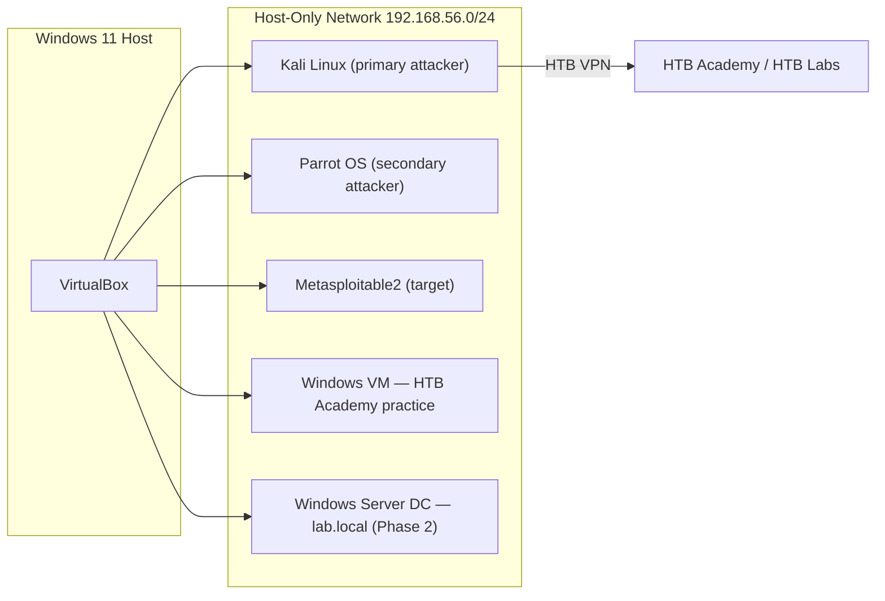
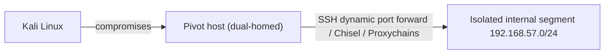

# Network Diagram

```mermaid
flowchart LR
    subgraph Host["Windows 11 Host"]
        VBox["VirtualBox"]
    end

    subgraph HostOnly["Host-Only Network 192.168.56.0/24"]
        Kali["Kali Linux (primary attacker)"]
        Parrot["Parrot OS (secondary attacker)"]
        Msf2["Metasploitable2 (target)"]
        WinVM["Windows VM — HTB Academy practice"]
        DC["Windows Server DC — lab.local (Phase 2)"]
    end

    VBox --> Kali
    VBox --> Parrot
    VBox --> Msf2
    VBox --> WinVM
    VBox --> DC

    Kali -- "HTB VPN" --> Internet["HTB Academy / HTB Labs"]
```

## Phase 3 addition — pivoting segment

```mermaid
flowchart LR
    Kali2["Kali Linux"] -->|compromises| Pivot["Pivot host (dual-homed)"]
    Pivot -->|SSH dynamic port forward / Chisel / Proxychains| Internal["Isolated internal segment 192.168.57.0/24"]
```

All IP ranges are private/lab-only (RFC 1918), no real external addresses.
